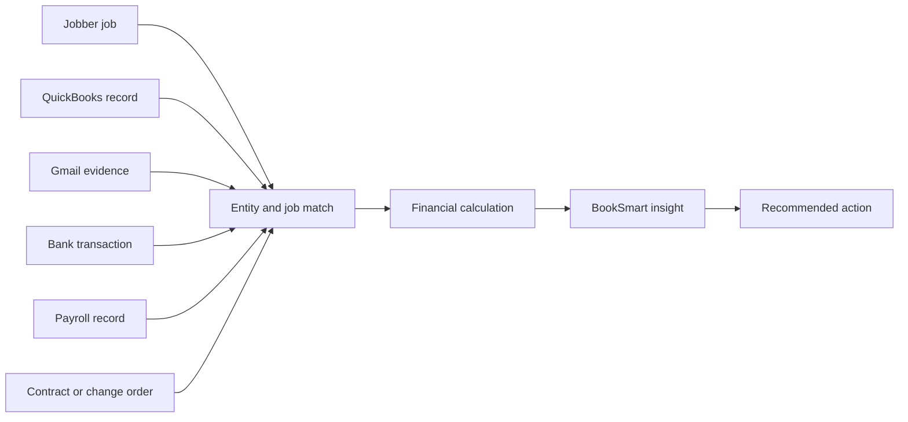

# BookSmart synthetic intelligence cases

## Purpose

These cases test whether BookSmart can connect facts across QuickBooks, Jobber,
Gmail, Plaid/bank activity, payroll records, receipts, and contracts. They are
not UI-only demonstrations and must not be implemented by pre-seeding the
expected insight.

The application receives only realistic provider-shaped source records. A
separate validator-only answer key contains the ground truth. BookSmart must
ingest, normalize, match, calculate, analyze, and explain the result through
its normal production pipeline.

## Integrity rules

- Never seed insight titles, recommendations, severity, or final conclusions.
- Never expose expected results or scenario metadata to application runtime.
- Never add scenario-name, tenant-ID, or fixture-amount conditions to
  production code.
- Treat cash, revenue, receivables, contract value, and future obligations as
  different financial concepts.
- Every material conclusion must link to its actual supporting records.
- Conflicting or incomplete evidence must reduce confidence or request human
  review rather than manufacture certainty.
- Removing a critical source record must change or suppress the dependent
  conclusion.
- Every business must be isolated from every other test tenant.

## Customer-facing visual evidence requirement

Every important insight must include a visual evidence map in the BookSmart UI.
The user must be able to see the records BookSmart connected, the relationship
between them, the calculation performed, and any missing or conflicting source.
Backend logs and test assertions alone do not satisfy this requirement.

Conceptually, the UI should make this path visible:

The visual must support:

- A plain-language insight and amount at the top.
- Labeled source nodes for QuickBooks, Jobber, Gmail, bank, payroll, receipts,
  and contracts when relevant.
- Visible links showing why records were matched, such as job number, customer
  alias, invoice number, amount, date, property, PO, or email reference.
- A calculation breakdown that distinguishes cash, AR, revenue, expenses,
  contract value, payroll, and future obligations.
- Status for confirmed, estimated, missing, stale, and conflicting evidence.
- Click-through from each source node to the underlying BookSmart record.
- A concise explanation of confidence and unresolved contradictions.
- Accessible labels and a readable narrow-screen layout; meaning must not rely
  on color alone.

Each Playwright case must open this visual evidence view and verify the source
nodes, relationships, calculation, confidence state, and linked records.

## Case 01: Healthy contractor using all four integrations

**Business:** Organized HVAC contractor with QuickBooks, Jobber, Gmail, and
Plaid.

**Source story:** Completed jobs have matching invoices, bank deposits match
payments, payroll clears on schedule, receipt emails support vendor charges,
and available cash covers near-term obligations.

**BookSmart should discover:** Healthy collections, supported revenue, stable
cash, and reasonable margins.

**False-positive traps:** No cash crisis, duplicate expense, overdue invoice,
fraud, or unbilled-work warning.

## Case 02: Busy but broke across all four integrations

**Business:** Plumbing contractor with rising booked revenue but slow-paying
customers.

**Source story:** Jobber shows a full schedule; QuickBooks shows growing
invoices and aging AR; Gmail contains customer payment delays and vendor due
notices; bank activity shows low available cash.

**BookSmart should discover:** Revenue growth does not equal available cash,
collections are slow, and upcoming obligations create working-capital
pressure.

**Required evidence:** AR invoices, bank balance, payroll/vendor due dates,
and relevant customer email threads.

## Case 03: Organized payroll creates a near-term shortfall

**Business:** Electrical contractor using all four integrations plus organized
payroll records.

**Source story:** Payroll of $28,000 is due Friday; available bank cash is
$21,000; QuickBooks contains $14,000 of unpaid receivables; Gmail confirms the
payroll debit date; Jobber has active work; contracts contain future milestone
payments that have not been earned.

**BookSmart should discover:** A $7,000 cash shortfall before payroll.

**False-positive traps:** Do not count AR, active-job value, or future contract
milestones as current cash. Do not say payroll has cleared before the bank
transaction posts.

## Case 04: Completed work missing its accounting invoice

**Business:** Landscaping contractor.

**Source story:** Jobber marks an Oak Ridge HOA job complete for $18,400; the
signed contract supports the value; Gmail confirms customer acceptance;
QuickBooks has no matching invoice; the bank has no matching deposit.

**BookSmart should discover:** $18,400 of completed, contract-supported work
may remain unbilled.

**Required matching:** Resolve customer-name variations and connect the
Jobber job, contract, and acceptance email while proving the absence of an
invoice and deposit.

## Case 05: Payment arrives under a different payer name

**Business:** Plumbing contractor.

**Source story:** Jobber and QuickBooks use “Lakeview Property Management”;
Gmail says payment will come from “LPM Holdings LLC”; the bank receives a
$9,750 deposit from LPM Holdings; the contract is signed by Lakeview.

**BookSmart should discover:** The invoice is paid despite the payer alias.

**False-positive traps:** Do not leave the invoice overdue or count the deposit
as unrelated income. Preserve both legal names and explain the match.

## Case 06: Cross-system margin leak

**Business:** HVAC contractor with a fixed-price replacement contract.

**Source story:** Contract price is $24,000; Jobber estimated $8,000 of
materials; QuickBooks contains $13,500 of vendor costs; bank withdrawals match
the vendors; Gmail contains supplier change details; payroll labor exceeds the
estimate.

**BookSmart should discover:** Actual margin is materially below the estimated
margin and identify material and labor overruns as the main drivers.

**False-positive traps:** Do not assign similarly dated expenses from another
job.

## Case 07: Similar charges that are both legitimate

**Business:** General contractor.

**Source story:** QuickBooks and the bank each contain two Home Depot charges
for $2,418. Gmail contains two different receipts, with different receipt
numbers, timestamps, and card evidence. Jobber and two contracts show the
materials belong to different jobs.

**BookSmart should discover:** Both charges are legitimate.

**False-positive trap:** Same merchant and amount are not sufficient evidence
of a duplicate.

## Case 08: True duplicate caused by import overlap

**Business:** Roofing contractor.

**Source story:** A purchase exists as a manually entered QuickBooks expense
and a bank-imported transaction. Gmail has one receipt, Jobber has one job-cost
entry, and vendor, amount, date, and card suffix agree.

**BookSmart should discover:** Two accounting records represent one real
purchase.

**Required behavior:** Do not double-count the expense or job cost. Recommend
human review or merge, not automatic deletion.

## Case 09: Email promise is not a payment

**Business:** Roofing contractor.

**Source story:** QuickBooks has a $31,500 overdue invoice; Gmail contains a
promise to pay next Tuesday; Jobber shows completed work; contract terms have
expired; no bank deposit exists.

**BookSmart should discover:** The receivable remains unpaid, with a promised
follow-up date.

**False-positive trap:** An email promise must never increase cash or mark an
invoice paid.

## Case 10: Approved change order remains uninvoiced

**Business:** Remodeling contractor.

**Source story:** Original contract is $60,000; Gmail contains an approved
$12,000 change order; Jobber total is revised to $72,000; QuickBooks invoiced
$60,000; the bank shows that $60,000 was collected.

**BookSmart should discover:** The original amount is paid, while $12,000 of
approved additional work may remain uninvoiced.

**False-positive trap:** Do not call the original invoice overdue.

## Case 11: Customer concentration hidden by entity names

**Business:** Commercial electrical contractor.

**Source story:** Jobber and QuickBooks use separate names for Westfield store
locations; contracts identify Westfield Holdings as the parent; Gmail uses one
AP domain; bank payments come from Westfield Holdings.

**BookSmart should discover:** The locations form one economic customer and
their consolidated revenue share crosses the concentration threshold.

**Required behavior:** Preserve store-level detail and show why the entities
were grouped.

## Case 12: No-QuickBooks contractor

**Business:** Small service contractor using Jobber, bank activity, Gmail,
payroll, receipts, and contracts but no accounting software.

**Source story:** Bank deposits and outflows show cash movement; Jobber shows
completed and active work; Gmail includes bills and customer acceptance;
payroll has a known debit; contracts support job values.

**BookSmart should discover:** Current cash, estimated inflows and operating
outflows, completed unbilled work, recurring costs, upcoming obligations, and
cash pressure without inventing accounting precision.

**Required qualification:** Clearly label estimates and identify which facts
cannot be known without accounting records.

## Case 13: Conflicting evidence across all sources

**Business:** Mechanical contractor.

**Source story:** Jobber says a job is complete; Gmail contains a customer
dispute saying work is incomplete; QuickBooks issued the final invoice; the
bank shows only a partial payment; the contract includes retainage; payroll
shows labor continued after the Jobber completion date.

**BookSmart should discover:** Completion and collectible value are uncertain,
partial payment and retainage must be separated, and human review is required.

**False-positive traps:** Do not state that the work is unquestionably complete,
fully unbilled, fully paid, or fully collectible.

## Independent validation requirements

For every case, the validator must independently verify:

- Provider record completeness and unique identifiers.
- Cross-source entity and transaction relationships.
- Invoice, payment, AR, cash, expense, job, payroll, and contract arithmetic.
- Expected findings, prohibited findings, and numeric tolerances.
- Evidence supporting every high-severity conclusion.
- False positives, false negatives, uncertainty handling, and recommendations.
- Tenant isolation and source freshness.
- That application tables and prompts never receive the answer key.
- That the visible evidence map accurately represents the relationships used by
  the intelligence engine rather than a decorative or separately mocked graph.

## Completion standard

A green browser test is not enough. A case passes only when BookSmart generated
the conclusion through its normal ingestion and intelligence pipeline, the
amount reconciles to the independent validator, the evidence is accessible,
the customer can visually inspect how the sources connect, and an anti-cheating
audit finds no scenario-specific production logic.
