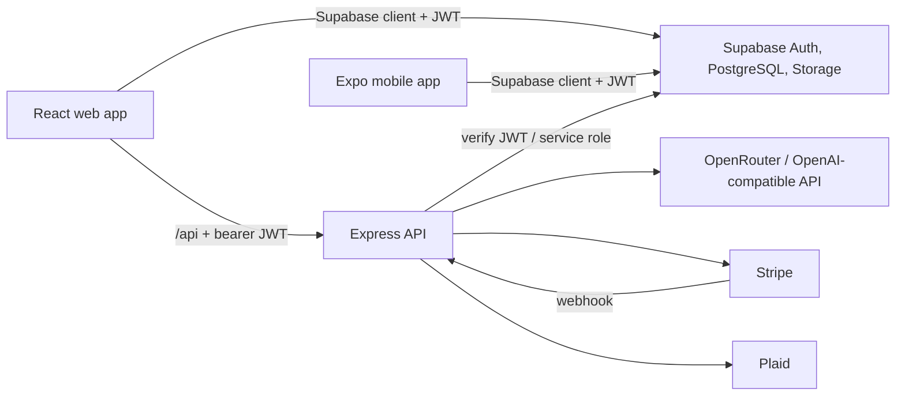

# BookSmart Technical Documentation

Last reviewed: July 31, 2026

## 1. Purpose and scope

BookSmart is a financial-management platform for freelancers and small businesses. It combines transaction and tax workflows, AI-assisted financial guidance, document processing, subscription and token payments, bank-data synchronization, and a marketplace that connects clients with CPAs.

This document describes the current monorepo implementation: its architecture, applications, data flow, configuration, API surface, security model, local development workflow, testing, and deployment.

## 2. System context

The platform has three application roles:

- **User**: manages businesses, transactions, reports, documents, subscriptions, tokens, tax workflows, AI guidance, CPA orders, and chat.
- **CPA**: manages leads, clients, orders, documents, earnings, referrals, insights, templates, and chat. CPA access is also affected by verification status.
- **Admin**: manages users, CPA verification, categories, tax-deduction rules, settings, and chat.

The browser and mobile applications use Supabase Auth. The web application accesses some Supabase data directly under row-level security (RLS) and calls the Express API for privileged operations and third-party integrations.



## 3. Technology stack

| Area | Technology |
|---|---|
| Monorepo | pnpm workspaces |
| Language | TypeScript 5.9 |
| Web | React 19, Vite 7, Wouter, TanStack Query |
| Styling/UI | Tailwind CSS 4, Radix UI, shadcn-style components |
| Mobile | Expo 54, React Native 0.81, Expo Router |
| API | Express 5, Pino logging, Multer uploads |
| Authentication/data | Supabase Auth, PostgreSQL, Storage, RLS |
| Payments | Stripe Checkout, subscriptions, webhooks |
| Bank data | Plaid Link and transaction sync |
| AI/document processing | OpenRouter or OpenAI-compatible API, PDF/DOCX/XLSX parsing |
| API contracts | OpenAPI, Orval, Zod |
| Database tooling | SQL migrations and Drizzle tooling |
| Web deployment | Nginx container |

## 4. Repository layout

```text
artifacts/
  booksmart/             React/Vite web application
    src/
      components/        Shared application and UI components
      hooks/             Authentication and application hooks
      lib/               Domain logic, Supabase client, API helpers
      pages/              Auth, user, CPA, and admin screens
    supabase/             SQL migrations and RLS policies
  api-server/            Express API
    src/
      lib/                Payment, access, logging, and domain helpers
      middlewares/        Authentication and role checks
      routes/             HTTP route modules
  booksmart-mobile/      Expo/React Native application
  mockup-sandbox/        Isolated UI mockup environment
lib/
  api-spec/              OpenAPI source and Orval configuration
  api-zod/               Generated Zod API types
  api-client-react/      Generated React Query client
  db/                    Drizzle schema and database utilities
scripts/                 Operational and seed scripts
docs/                    Engineering documentation
```

## 5. Runtime architecture

### 5.1 Web application

The web application entry point is `artifacts/booksmart/src/App.tsx`. It composes:

- a global TanStack Query client;
- theme and tooltip providers;
- the Supabase-backed authentication provider;
- Wouter routing;
- role guards and the shared dashboard layout;
- toast notification providers.

Public routes are `/login`, `/sign-up`, `/forgot-reset`, `/verify-email`, and `/oauth-consent`. Authenticated routes are grouped under `/user`, `/cpa`, and `/admin`.

At `/`, routing uses the authenticated profile to select the correct dashboard. An unapproved CPA is sent to `/cpa/under-review`. Users who still require legal consent are forced through `/oauth-consent`.

During development, Vite proxies `/api` to `http://localhost:8080`. `BASE_PATH` controls the Vite and Wouter base path.

### 5.2 Mobile application

The mobile client uses Expo Router and connects to the same Supabase project as the web client. Its routes are organized into authentication, user-tab, and CPA-tab groups. Mobile configuration uses `EXPO_PUBLIC_*` variables because those values must be available in the client bundle.

The current `dev` command includes Replit-specific environment variables. Outside Replit, run Expo with appropriate local environment values or adapt that script for the target environment.

### 5.3 API server

The API server mounts all application endpoints under `/api`. It uses:

- `pino-http` for structured request logging;
- permissive CORS middleware;
- a raw-body parser for the Stripe webhook, mounted before the JSON parser;
- JSON and URL-encoded request limits of 15 MB;
- route-specific authentication and authorization middleware.

The process requires a valid positive `PORT` value. Its normal local port is `8080`.

### 5.4 Shared libraries

- `@workspace/api-spec` owns `openapi.yaml` and generates clients with Orval.
- `@workspace/api-zod` exposes generated request/response validation types.
- `@workspace/api-client-react` exposes generated TanStack Query hooks and a custom fetcher.
- `@workspace/db` exposes Drizzle database and schema utilities.

When the OpenAPI contract changes, regenerate the clients rather than editing generated files manually:

```bash
pnpm --filter @workspace/api-spec run codegen
```

## 6. Authentication and authorization

The browser creates a Supabase client from `VITE_SUPABASE_URL` and `VITE_SUPABASE_ANON_KEY`. Authenticated API calls send the Supabase access token as:

```http
Authorization: Bearer <supabase-access-token>
```

`requireAuth` validates this token through Supabase's `/auth/v1/user` endpoint and places the resolved Auth user ID in `req.supabaseUserId`.

Additional middleware includes:

- `requireAdmin`, for administrative operations;
- `requireApprovedCpa`, for verified CPA-only operations.

Database RLS provides a second authorization boundary. The Phase 3 migration introduces CPA/client access grants and policies for users, organizations, transactions, orders, documents, AI strategies, chats, and messages.

### Current security caveat

Authentication is not consistently attached to every sensitive route in the current source. In particular, the admin account-management routes, CPA order update route, and document download route are mounted without an explicit route-level auth middleware. Treat the API as **not ready for exposure to an untrusted network** until every privileged endpoint has the appropriate authentication and role check and the behavior is covered by negative authorization tests.

Service-role credentials bypass RLS and must exist only on the API server. Never expose `SUPABASE_SERVICE_ROLE_KEY`, Stripe secrets, Plaid secrets, or AI provider keys to browser/mobile bundles or logs.

## 7. Data model

Supabase is the primary data store. The repository contains incremental SQL migrations, not necessarily a complete bootstrap schema for every historical table.

Major domain entities referenced by the application and migrations include:

| Domain | Main entities |
|---|---|
| Identity/access | `users`, `cpa_client_access` |
| Businesses | `organizations`, `organization_survey_progress` |
| Finance | `transactions`, `categories`, `category_rules`, `tax_deduction_rules` |
| Banking | `plaid_items`, `plaid_accounts` |
| CPA workflow | `orders` |
| Documents | `documents`, `user_documents` |
| AI | `ai_strategies`, `ai_tax_strategies` |
| Communication | `chats`, `messages` |
| Monetization | `feature_unlocks`, `token_transactions`, subscription fields on users |

The CPA access migration defines helper functions that determine current application identity/role, approved CPA status, client and organization access, and whether an open order grants access. Triggers synchronize access grants with order and organization changes.

Later migrations add deletion cascades for user-owned organizations, documents, and token transactions. Apply migrations in filename/date order and test them in a non-production Supabase project before production rollout.

## 8. API overview

All paths below are relative to `/api`. `Auth` means a Supabase bearer token is required by the current route implementation.

### Platform and AI

| Method | Path | Auth | Purpose |
|---|---|---:|---|
| GET | `/healthz` | No | Health check |
| POST | `/openai-chat` | Yes | Proxied AI chat/strategy response |
| POST | `/extract-document` | Yes | Extract structured data from a document |
| POST | `/extract-text` | Yes | Extract document text |
| POST | `/business-document/extract` | Yes | Extract business-profile data |
| POST | `/scan-statement` | Yes | Parse a financial statement |
| POST | `/clean-pl-transactions` | Yes | Normalize profit-and-loss transactions |

### Documents and avatars

| Method | Path | Auth | Purpose |
|---|---|---:|---|
| POST | `/document-upload` | Yes | Upload a user document |
| POST | `/chat-upload` | Yes | Upload a chat attachment |
| POST | `/document-signed-url` | Yes | Create a signed document URL |
| GET | `/document-download` | No* | Proxy a document download |
| DELETE | `/document-delete` | Yes | Delete a document |
| POST | `/avatar` | Yes | Upload/update an avatar |
| DELETE | `/avatar` | Yes | Delete an avatar |

`No*` denotes a current security gap, not a recommendation.

### Financial statements, Plaid, and limits

| Method | Path | Auth | Purpose |
|---|---|---:|---|
| GET | `/financial-statements/review` | Yes | Get statement review data |
| POST | `/financial-statements` | Yes | Persist an imported statement |
| PATCH | `/financial-statements/:id` | Yes | Update statement review state |
| POST | `/plaid/link-token` | Yes | Create a Plaid Link token |
| POST | `/plaid/exchange-public-token` | Yes | Exchange a public token |
| POST | `/plaid/sync` | Yes | Synchronize accounts/transactions |
| DELETE | `/plaid/items/:itemId` | Yes | Disconnect a Plaid item |
| GET | `/plan-limits/usage` | Yes | Get plan usage |
| POST | `/plan-limits/check-ai-strategy` | Yes | Check AI-strategy entitlement |
| POST | `/plan-limits/check-add-business` | Yes | Check business-count entitlement |
| POST | `/plan-limits/check-add-transaction` | Yes | Check transaction entitlement |

### Stripe and tokens

| Method | Path | Auth | Purpose |
|---|---|---:|---|
| GET | `/stripe/catalog` | No | Return plans and token packages |
| GET | `/stripe/status` | Yes | Return subscription/token status |
| POST | `/stripe/create-checkout-session` | Yes | Start subscription checkout |
| POST | `/stripe/create-token-checkout` | Yes | Start token-package checkout |
| POST | `/stripe/confirm-checkout` | Yes | Confirm and reconcile checkout |
| POST | `/stripe/cancel-subscription` | Yes | Schedule subscription cancellation |
| POST | `/stripe/resume-subscription` | Yes | Resume a scheduled cancellation |
| POST | `/stripe/webhook` | Signature | Process Stripe events using raw body |
| GET | `/token-unlocks/catalog` | No | Return unlock catalog |
| GET | `/token-unlocks/summary` | Yes | Return unlock summary |
| GET | `/token-unlocks/status` | Yes | Return unlock status |
| POST | `/token-unlocks/spend` | Yes | Spend tokens on a feature |

### Accounts, CPA, referrals, and admin

| Method | Path | Auth | Purpose |
|---|---|---:|---|
| POST | `/auth/ensure-profile` | Yes | Ensure an application profile exists |
| POST | `/referrals/send` | Yes | Send a referral |
| PATCH | `/cpa/orders/:orderId` | No* | Update a CPA order |
| GET | `/admin/accounts` | No* | List account/subscription data |
| POST | `/admin/set-token-balance` | No* | Set a user's token balance |
| POST | `/admin/set-plan` | No* | Set a user's plan |
| DELETE | `/admin/users/:userId` | No* | Delete a user |
| PATCH | `/admin/cpas/:cpaId/verification` | No* | Change CPA verification status |

For exact payload and response structures, consult the route source and `lib/api-spec/openapi.yaml`. The OpenAPI specification may cover only the generated-client subset and should be kept synchronized as endpoints evolve.

## 9. Configuration

Create a root `.env` file for local server configuration. Do not commit real values. The existing root `.env` is intentionally excluded by `.gitignore` and should be treated as sensitive.

### Core

| Variable | Consumer | Required/usage |
|---|---|---|
| `PORT` | API, web | Required by API and Vite configuration |
| `BASE_PATH` | Web | Required Vite base path, commonly `/` |
| `NODE_ENV` | API, web | Runtime mode |
| `LOG_LEVEL` | API | Pino log level |

Because the API and web dev processes use different ports, set variables per process (for example, web `PORT=24254`, API `PORT=8080`) rather than relying on one shared `PORT` value for simultaneous startup.

### Supabase

| Variable | Exposure | Purpose |
|---|---|---|
| `VITE_SUPABASE_URL` | Public web bundle | Web Supabase project URL |
| `VITE_SUPABASE_ANON_KEY` | Public web bundle | Web anonymous key; protected by RLS |
| `EXPO_PUBLIC_SUPABASE_URL` | Public mobile bundle | Mobile Supabase project URL |
| `EXPO_PUBLIC_SUPABASE_ANON_KEY` | Public mobile bundle | Mobile anonymous key; protected by RLS |
| `SUPABASE_URL` | Server | Server Supabase project URL |
| `SUPABASE_ANON_KEY` | Server | JWT validation/auth requests |
| `SUPABASE_SERVICE_ROLE_KEY` | Secret/server only | Privileged database/storage operations |
| `DATABASE_URL` | Secret/tooling | Direct PostgreSQL/Drizzle connection |

### External services

| Variable | Exposure | Purpose |
|---|---|---|
| `OPENROUTER_API_KEY` | Secret/server only | Preferred OpenRouter credential |
| `OPENAI_API_KEY` | Secret/server only | OpenAI-compatible fallback/configuration |
| `VITE_STRIPE_PUBLISHABLE_KEY` | Public web bundle | Stripe.js initialization |
| `STRIPE_SECRET_KEY` | Secret/server only | Stripe server API client |
| `STRIPE_WEBHOOK_SECRET` | Secret/server only | Stripe webhook signature validation |
| `PLAID_CLIENT_ID` | Secret/server only | Plaid client identifier |
| `PLAID_SECRET` | Secret/server only | Plaid secret |
| `PLAID_ENV` | Server | Plaid environment selection |
| `PLAID_DAYS_REQUESTED` | Server | Transaction-history window |

## 10. Local development

### Prerequisites

- Node.js 22 or newer (the containers use Node 22)
- pnpm via Corepack
- a configured Supabase project
- external-service credentials for the features being exercised

### Install

```bash
corepack enable
pnpm install --frozen-lockfile
```

The workspace enforces pnpm and applies a 24-hour minimum package release age as a supply-chain control. Do not disable this setting; use the narrow allowlist only for a reviewed urgent exception.

### Start the API

PowerShell:

```powershell
$env:PORT = "8080"
pnpm --filter @workspace/api-server run dev
```

### Start the web app

In a second PowerShell session:

```powershell
$env:PORT = "24254"
$env:BASE_PATH = "/"
pnpm --filter @workspace/booksmart run dev
```

Open `http://localhost:24254`. Requests under `/api` are proxied to port `8080`.

### Start mobile

```bash
pnpm --filter @workspace/booksmart-mobile run dev
```

The checked-in script assumes Replit variables. For conventional local Expo development, configure the `EXPO_PUBLIC_SUPABASE_*` values and invoke Expo with a locally appropriate host/port command.

## 11. Build, test, and quality checks

### Whole workspace

```bash
pnpm run typecheck
pnpm run build
```

The root build runs type checking before recursive package builds.

### Package tests

```bash
pnpm --filter @workspace/booksmart run test
pnpm --filter @workspace/api-server run test
```

The repository contains additional `*.test.ts` files that are not included in the current package `test` scripts. To avoid a false sense of coverage, either add them to the scripts or switch to a test-file glob supported consistently across environments.

High-risk workflows that should have integration coverage include:

- rejected unauthenticated and wrong-role API requests;
- Stripe webhook idempotency and token fulfillment;
- subscription cancellation/resumption;
- Plaid item ownership and sync deduplication;
- document ownership, signed URLs, download, and deletion;
- RLS behavior for users, approved CPAs, and admins;
- user deletion and cascade behavior.

## 12. Container deployment

`docker-compose.yml` defines two services:

- `api`: builds `Dockerfile.api`, exposes port `8080`, and loads the root `.env`;
- `web`: builds `Dockerfile.web`, serves static assets through Nginx, and exposes host port `5173`.

Run:

```bash
docker compose up --build
```

Nginx serves the single-page application, falls back to `index.html` for client routes, allows request bodies up to 60 MB, and proxies `/api/` to the API container.

Deployment considerations:

- inject production secrets through the deployment platform rather than baking them into images;
- terminate TLS at the load balancer/reverse proxy;
- restrict CORS to trusted origins in production;
- expose the Stripe webhook through HTTPS and configure its signing secret;
- add readiness/liveness checks against `/api/healthz`;
- centralize and retain structured logs without logging tokens or document contents;
- run migration and rollback procedures separately from application startup.

## 13. Operational troubleshooting

| Symptom | Likely cause/check |
|---|---|
| API exits immediately | `PORT` is missing, non-numeric, or non-positive |
| Vite exits immediately | `PORT` or `BASE_PATH` is missing |
| Web throws during startup | `VITE_SUPABASE_URL` or `VITE_SUPABASE_ANON_KEY` is missing |
| API returns 401 | Missing, expired, or invalid Supabase bearer token |
| API returns auth-service 503 | Server Supabase URL/anon key missing or Supabase unreachable |
| Web `/api` requests fail | API is not listening on port 8080 or proxy target differs |
| Stripe webhook signature fails | Wrong webhook secret or raw body was parsed before verification |
| Database calls fail despite login | RLS policy, Auth-ID/application-user mapping, or organization ownership mismatch |
| Mobile dev command fails locally | Replit-only variables in the package script are absent |
| `pnpm install` rejects a new release | Workspace's 24-hour minimum-release-age policy |

## 14. Engineering conventions

- Use pnpm for all dependency and workspace operations.
- Treat generated files under `lib/api-zod/src/generated` and `lib/api-client-react/src/generated` as codegen output.
- Keep provider secrets server-side and use public-prefix variables only for intentionally public client configuration.
- Require authentication first, then role/ownership authorization, for every privileged route.
- Preserve Stripe webhook raw-body parsing order.
- Use Supabase RLS even when the API performs authorization; defense in depth is intentional.
- Add migrations rather than editing already-applied production SQL.
- Run type checks, relevant unit tests, and negative authorization tests before deployment.

## 15. Known documentation and implementation follow-ups

1. Attach `requireAuth` plus `requireAdmin`/`requireApprovedCpa` to every privileged route that currently lacks them.
2. Expand `lib/api-spec/openapi.yaml` until it represents the complete public API, including auth requirements and error schemas.
3. Add an example environment file containing names and safe placeholders only.
4. Make package test scripts discover all tests consistently.
5. Document a clean Supabase bootstrap path; the checked-in migrations appear incremental and reference pre-existing tables.
6. Define production CORS allowlists and upload size/type policies.
7. Add CI gates for type checking, tests, API contract generation drift, and migration validation.
